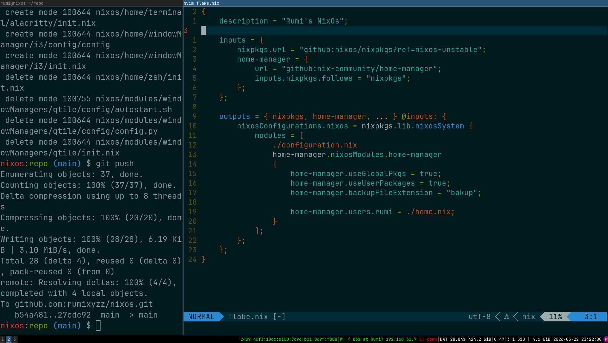

# nixos

the entirety of my /etc/nixos directory. Feel free to to just replace yours with mine (maybe except for the hardware-configuration.nix, don't change that one)
and you will (hopefully) get my setup.

I do use home-manager so there's no need to get any of my configs seperately, they're all in here.

enjoy :)
